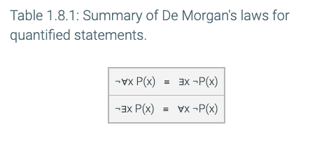

# Notes

## 1.6 - Predicates and quantifiers

**_predicate_** a logical statement whose truth value is a function of one or more variables

> x is odd.
> 16 = x^2

**_domain_** of a variable in a predicate is the set of all possible values for the variable.

**_universal quantifier_** ∀

> The logical statement ∀x P(x) is read "for all x, P(x)" or "for every x, P(x)".
> The statement ∀x P(x) asserts that P(x) is true for every possible value for x in its domain.
> The symbol ∀ is a **universal quantifier** and the statement ∀x P(x) is called a **universally quantified statement**.
> ∀x P(x) is a proposition because it is either true or false. ∀x P(x) is true if and only if P(n) is true for every n in the domain.

**_counterexample_** for a universally quantified statement is an element in the domain for which the predicate is false.

> For example, consider the statement ∀x (x2 > x), in which the domain is the set of positive integers.
> When x = 1, then x2 = x and the statement x2 > x is not true.
> Therefore x = 1 is a counterexample that shows the statement "∀x (x2 > x)" is false.

**_existential quantifier_** ∃

> The logical statement ∃x P(x) is read "There exists an x, such that P(x)".
> The statement ∃x P(x) asserts that P(x) is true for at least one possible value for x in its domain.
> The symbol ∃ is an **existential quantifier** and the statement ∃x P(x) is called a **existentially quantified statement**.

## 1.7 - Quantified statements

**_quantified statement_** a logical statement that includes a universal or existential quantifier

> NOTE: The quantifiers ∀ and ∃ are applied before the logical operations (∧, ∨, →, and ↔) used for propositions. This means that the statement ∀x P(x) ∧ Q(x) is equivalent to (∀x P(x)) ∧ Q(x) as opposed to ∀x (P(x) ∧ Q(x)).

**_free variable_** variable x is the predicate P(x) because it is free to take on any value in the domain. The variable x in the statement ∀x P(x) is a **bound variable** because the variable is bound to a quantifier.

> (∀x P(x)) ∧ Q(x)
>
> the x in P(x) is bound by the universal quantifier but Q(x) is not, therefore it is _NOT a proposition_
>
> ∀x (P(x) ∧ Q(x))
>
> both variable x's are bound by the univeral quantifier (∀x), therefore it is a _proposition_

**_Logical equivalence with quantified statements_** \
Two quantified statements have the same logical meaning if they have the same truth value regardless of the predicates for the elements in the domain

> P(x): x came to the party
> S(x): x was sick
>
> "Everyone was not sick" is logically equivalent to "∀x ¬S(x)"

## 1.8 - De Morgan's law for quantified statements

The negation operation can be applied to a quantified statement

> ¬∀x F(x)
>
> x is the set of all birds
> F(x) is "x can fly"
>
> "Not all birds can fly."
>
> which create the following logical equivalence:
>
> ¬∀x F(x) ≡ ∃x ¬F(x)

**_Applying De Morgan's law for quantified statements to English statements_**

> P(x): x showed up with a pencil
> C(x): x showed up with a calculator
>
> Sample question: Every student showed up with a calculator.
>
> ∀x C(x)
> Negation: ¬∀x C(x)
> Applying De Morgan's law: ∃x ¬C(x)
> English: Some student showed up without a calculator.
