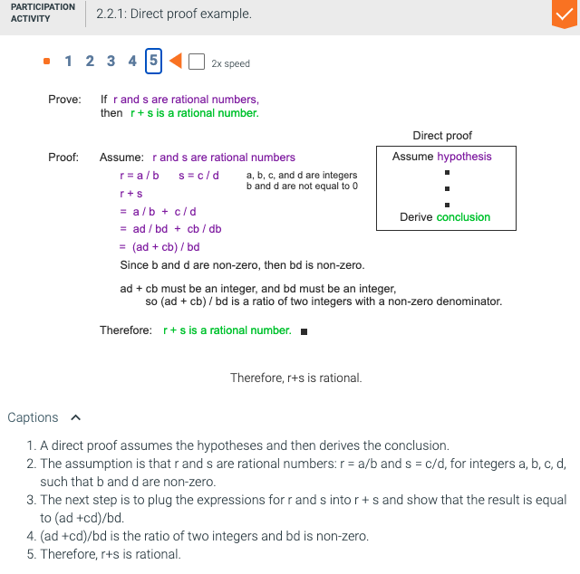

# Notes

## 2.1 - Introduction to proofs

**_theorem_** a statement that can be proven to be true.

**_proof_** consists of a series of steps, each of which follows logically from assumptions, or from previously proven statements, whose final step should result in the statement of the theorem being proven.

**_axioms_** are the statements assumed to be true that may be ysed in the proof of a theorem.

- A proof may make use of previously proven theorems.
- Mathematical proofs are typically expressed in English. Formalism of logic provides a good foundation for mathematical reasoning used in proving theorems.
- Proofs should read like a verbal argument.

> A simple theorem:
>
> Every positive integer is less than or equal to its square.
>
> Proof:
>
> Let x be an integer x > 0.
>
> Since x is an integer and x > 0, then x >= 1.
>
> Since x > 0, we can multiply both sides of the inequality by x to get: x _ x >= 1 _ x.
>
> Simplify the expression we get x^2 >= x

**_The process of writing proofs_**

- many proofs follow one a relatively small number of patterns
- coming up with proofs requires trial and error
- the process requires experimenting with small examples in order to develop intuition about a more general rule
- the process entails somde dead ends along the way

**_Proofs of universal statements_**

- before proving a theorem, it's helpful to rewrite the statement using precise mathematical language.
- most theorems are assertions about all the elements in a set and are therefore universal statements (even if the theorem does not explicitly use a universal quantifier)
- STEP 1: in proving a universal statement, name a generic object in the domain and prove the statement for that object.
- STEP 2: write down everything you know about the object and what needs to be proven.

**_Proofs by exhaustion_**

- If the domain of a universal statement is small, it may be easiest to prove the statement by checking each element individually. (**_proof of exhaustion_**)
  > If n ∈ {-1, 0, 1}, then n2 = |n|
  >
  > Proof:
  >
  > Check the equality for each possible value of n:
  >
  > n = -1: (-1)2 = 1 = |-1|.
  >
  > n = 0: (0)2 = 0 = |0|.
  >
  > n = 1: (1)2 = 1 = |1|.

**_Counterexamples_** \n
**_counterexample_** is an assignment of values to variables that shows that a universal statement is false.

- a proof of a universal statement requires a more general argument that holds for all objects in the domain.
- a counterexample for a conditional statement must satisfy all the hypotheses and contradict the conclusion.

## 2.2 - Direct proofs

- many mathematical theorems take the form of a conditional statement
  > p -> c, where p is a proposition that is a conjunction of all the hypotheses and c is the conlclusion.

**_direct proof_** of a conditional statement, the hypothesis p is assumed to be true and the conclusion c is proven as a direct result of the assumption.

- many theorems are conditional statements that also have a universal quantifier such as:
  > For every integer n, if n is odd then n^2 is odd.

