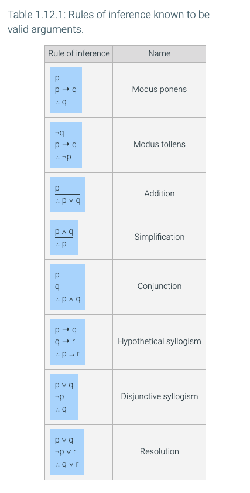
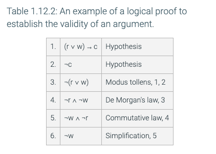

# Notes

## 1.11 - Logical reasoning

**_argument_** is a sequence of propositions called **_hypotheses_**, followed by a final proposition called the **_conclusion_**. An argument is **_valid_** if the conclusion is true whenever the hypotheses are all true, otherwise the argument is **_invalid_**.

> p1 ... pn are the hypotheses and c is the conclusion. The symbol ∴ reads "therefore". The argument is valid whenever the proposition ( p1 ∧ p2 ∧ ... ∧ pn ) → c is a tautology.

**_The form of an argument_**

> The hypotheses and conclusion in a logical argument can also be expressed in English, as in:
>
> It is raining today.
>
> If it is raining today, I will not ride my bike to school.
>
> ∴ I will not ride my bike to school.

**_form_** of an argument expressed in English is obtained by replacing each individual proposition with a variable. While it is common to express a logical argument in English, the validity of an argument is established by analyzing its form. Define propositional variables p and q to be:

> p: It is raining today.
>
> q: I will not ride my bike to school.

## 1.12 - Rules of inference with propositions

Using truth tables to establish the validity of an argument can become tedious, especially if an argument uses a large number of variables. Fortunately, some arguments can be shown to be valid by applying rules that are themselves arguments that have already been shown to be valid. The laws of propositional logic can also be used in establishing the validity of an argument.

**_logical proof_** the validity of an argument can be established by applying the rules of inference and laws of propositional logic.

> a logical proof of an argument is a sequence of steps, each of which consists of a proposition and a justification.
>
> if the proposition in a step is a hypothesis, the justification is "Hypothesis". Otherwise, the proposition must follow from previous steps by applying one law of logic or rule of inference.
>
> Here is an argument expressed in English:
>
> If it is raining or windy or both, the game will be cancelled.
>
> _The game will not be cancelled._
>
> It is not windy
> The first step in proving the validity of the argument is to assign variable names to each of the individual propositions:
> w: It is windy
>
> r: It is raining
>
> c: The game will be cancelled
> Replacing English phrases with variable names results in the following argument form:
> (r ∨ w) → c
>
> _¬c_
>
> ¬w

The final step is to prove that the argument is valid using a logical proof.

