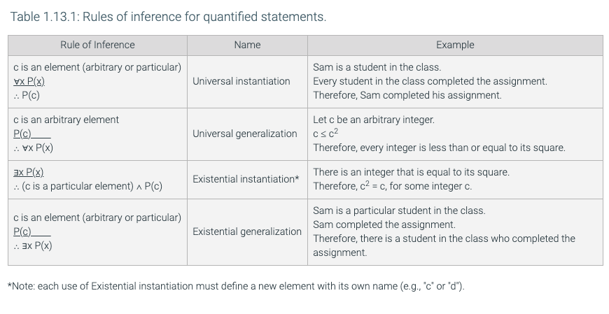

# Notes

## 1.11 - Logical reasoning

**_argument_** is a sequence of propositions called **_hypotheses_**, followed by a final proposition called the **_conclusion_**. An argument is **_valid_** if the conclusion is true whenever the hypotheses are all true, otherwise the argument is **_invalid_**.

> p1 ... pn are the hypotheses and c is the conclusion. The symbol ∴ reads "therefore". The argument is valid whenever the proposition ( p1 ∧ p2 ∧ ... ∧ pn ) → c is a tautology.

**_The form of an argument_**

> The hypotheses and conclusion in a logical argument can also be expressed in English, as in:
>
> It is raining today.
>
> If it is raining today, I will not ride my bike to school.
>
> ∴ I will not ride my bike to school.

**_form_** of an argument expressed in English is obtained by replacing each individual proposition with a variable. While it is common to express a logical argument in English, the validity of an argument is established by analyzing its form. Define propositional variables p and q to be:

> p: It is raining today.
>
> q: I will not ride my bike to school.

## 1.12 - Rules of inference with propositions

Using truth tables to establish the validity of an argument can become tedious, especially if an argument uses a large number of variables. Fortunately, some arguments can be shown to be valid by applying rules that are themselves arguments that have already been shown to be valid. The laws of propositional logic can also be used in establishing the validity of an argument.

**_logical proof_** the validity of an argument can be established by applying the rules of inference and laws of propositional logic.

> a logical proof of an argument is a sequence of steps, each of which consists of a proposition and a justification.
>
> if the proposition in a step is a hypothesis, the justification is "Hypothesis". Otherwise, the proposition must follow from previous steps by applying one law of logic or rule of inference.
>
> Here is an argument expressed in English:
>
> If it is raining or windy or both, the game will be cancelled.
>
> _The game will not be cancelled._
>
> It is not windy
> The first step in proving the validity of the argument is to assign variable names to each of the individual propositions:
> w: It is windy
>
> r: It is raining
>
> c: The game will be cancelled
> Replacing English phrases with variable names results in the following argument form:
> (r ∨ w) → c
>
> _¬c_
>
> ¬w

The final step is to prove that the argument is valid using a logical proof.

## 1.13 - Rules of inference with quantifiers

In order to apply the rules of inference to quantified expressions, such as ∀x ¬(P(x) ∧ Q(x)), we need to remove the quantifier by plugging in a value from the domain to replace the variable x.

**_element_** a value that can be plugged in for variable x of the domain of x.

> For example, if the domain is the set of all integers, ¬(P(3) ∧ Q(3)) is a proposition to which De Morgan's law can be applied.
>
> Elements of the domain can be defined in a hypothesis of an argument. In the example below, the domain is a set of employees at a company. The second line defines Linda as an element of the domain.
>
> Every employee who received a large bonus works hard.
>
> Linda is an employee at the company.
>
> Linda received a large bonus.
>
> ∴ Some employee works hard.

There are two types of named elements used in logical proofs.
**_arbitrary element_** of a domain has no special properties other than those shared by all the elements of the domain.
**_particular element_** of a domain may have properties that are not shared by all the elements of the domain.

> if the domain is the set of all integers, 3 is a particular element of the domain. The number 3 is odd which is not a property that is shared by all integers. Every domain element referenced in a proof must be defined on a separate line of the proof. If the element is defined in a hypothesis, it is always a particular element and the definition of that element in the proof is labeled "Hypothesis". If an element is introduced for the first time in the proof, the definition is labeled "Element definition" and must specify whether the element is arbitrary or particular.

**_existential instantiation_** and **_universal instantiation_** replace a quantified variable with an element of the domain.

The rules of **_existential generalization_** and **_universal generalization_** replace an element of the domain with a quantified variable.

**_Multiple uses of existential instantiation: a common mistake_**

> important to define a new particular element with a new name for each use of existential instantiation within the same logical proof in order to avoid a faulty proof that an invalid argument is valid.

**_Showing an argument with quantified statements is invalid_**

> An argument with quantified statements can be shown to be invalid by defining a domain and predicates for which the hypotheses are all true but the conclusion is false. For example, consider the invalid argument:
>
> ∃x P(x)
>
> ∃x Q(x)
>
> ∃x (P(x) ∧ Q(x)
